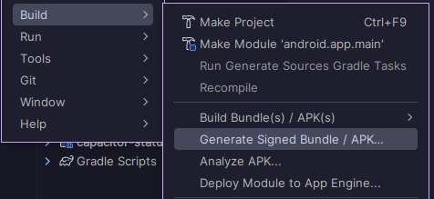
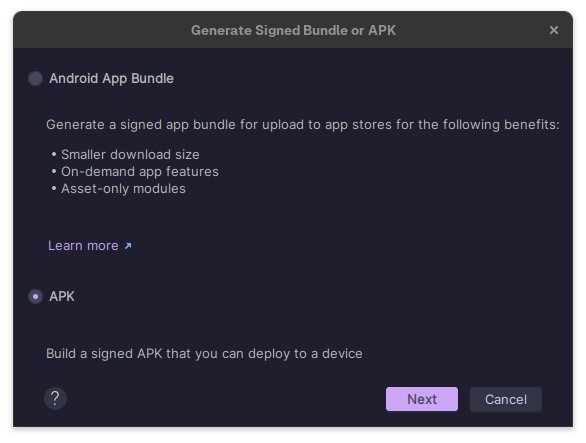
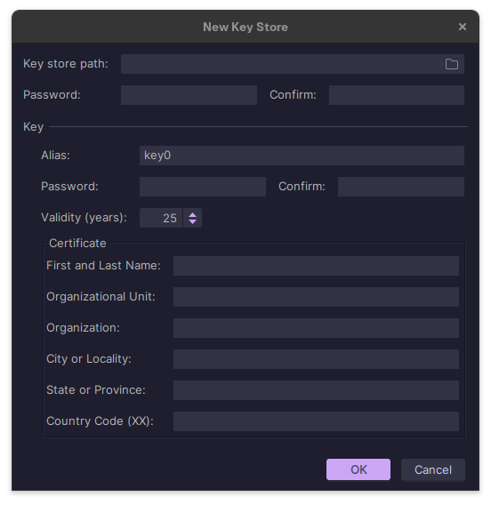
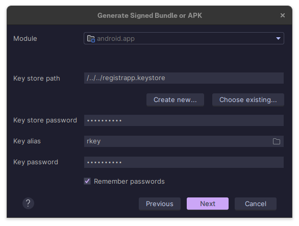
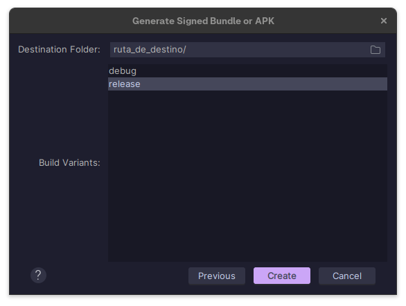
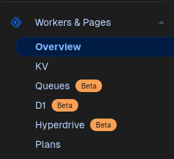
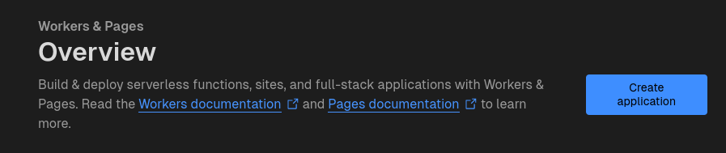
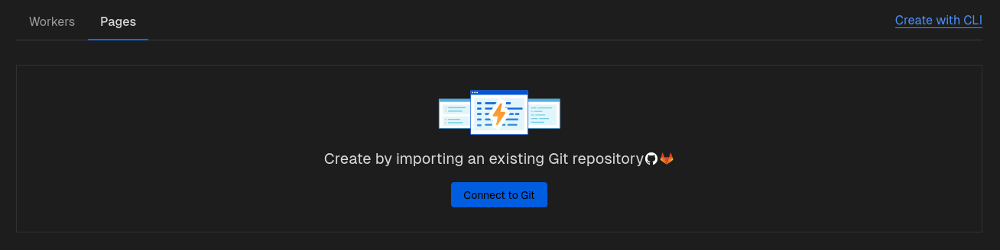
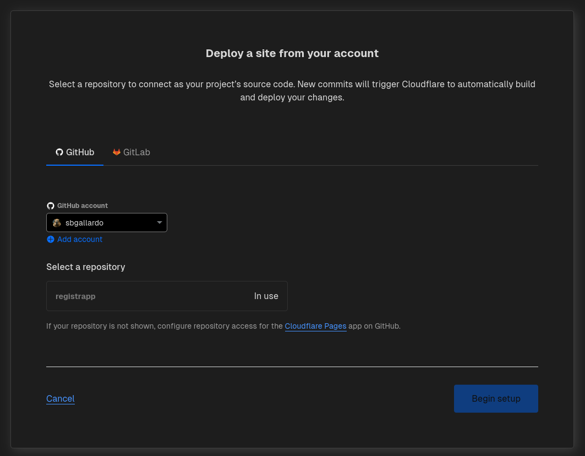
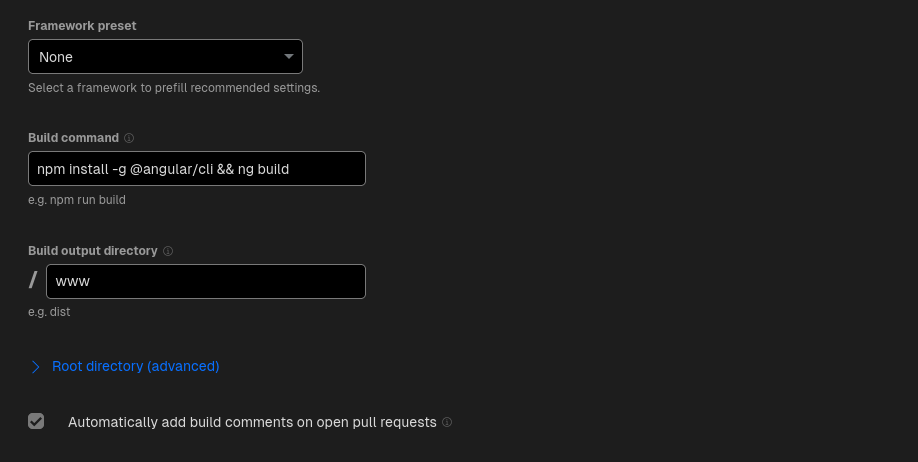

# RegistrAPP

## Descripción
Aplicación para el registro de asistencia de estudiantes mediante el uso de un código QR.
Esta app fue desarrollada con el framework Ionic y Angular, y se compila a android mediante Capacitor,
ademas utiliza [Supabase](https://supabase.com/) como backend para el almacenamiento de datos y la autenticación
y creacion de cuentas de usuarios.

## Contenidos

- [RegistrAPP](#registrapp)
  - [Descripción](#descripción)
  - [Contenidos](#contenidos)
  - [Como iniciar y compilar el proyecto](#como-iniciar-y-compilar-el-proyecto)
    - [1. Clonar el repositorio](#1-clonar-el-repositorio)
    - [2. Instalar las dependencias](#2-instalar-las-dependencias)
    - [3. Iniciar el servidor de desarrollo](#3-iniciar-el-servidor-de-desarrollo)
  - [Compilar a android](#compilar-a-android)
    - [1. Instalar las dependencias](#1-instalar-las-dependencias)
    - [2. Generar el build de angular](#2-generar-el-build-de-angular)
    - [3. Agregar la plataforma android](#3-agregar-la-plataforma-android)
    - [4. Sincronizar el proyecto](#4-sincronizar-el-proyecto)
    - [5. Compilar el proyecto](#5-compilar-el-proyecto)
  - [Firmar el apk](#firmar-el-apk)
    - [1. Generar apk en android studio](#1-generar-apk-en-android-studio)
    - [2. Selecciona la opción APK](#2-selecciona-la-opción-apk)
    - [3. Crea una nuevo keystore](#3-crea-una-nuevo-keystore)
    - [4. Selecciona tu keystore](#4-selecciona-tu-keystore)
    - [5. Compila tu aplicación](#5-compila-tu-aplicación)
  - [Despliega tu aplicación en un hosting](#despliega-tu-aplicación-en-un-hosting)
    - [1. Crea una cuenta en Cloudflare](#1-crea-una-cuenta-en-cloudflare)
    - [2. Ingresa al apartado Workers & Pages y crea una nueva aplicación](#2-ingresa-al-apartado-workers--pages-y-crea-una-nueva-aplicación)
    - [3. Selecciona la opción Pages y conecta tu repositorio](#3-selecciona-la-opción-pages-y-conecta-tu-repositorio)
    - [4. Selecciona tu repositorio y continua](#4-selecciona-tu-repositorio-y-continua)
    - [5. Configura el build de tu aplicación](#5-configura-el-build-de-tu-aplicación)


## Como iniciar y compilar el proyecto

### 1. Clonar el repositorio
```shell
git clone https://github.com/sbgallardo/registrapp.git && cd registrapp/
```

### 2. Instalar las dependencias
```shell
npm i
```

### 3. Iniciar el servidor de desarrollo
```shell
ionic serve
```

[Volver al indice de contenidos ⮝](#contenidos)

## Compilar a android

### 1. Instalar las dependencias
```shell
npm install -g @ionic/cli @capacitor/cli @angular/cli
```

### 2. Generar el build de angular
```shell
ng build
```

### 3. Agregar la plataforma android
```shell
npx cap add android
```

### 4. Sincronizar el proyecto
```shell
npx cap sync
```

### 5. Compilar el proyecto
```shell
npx cap open android
```
*Para este paso necesitas haber instalado [Android Studio](https://developer.android.com/studio/) antes y haber configurado la variable de entorno que apunte al ejecutable de Android Studio.*

[Volver al indice de contenidos ⮝](#contenidos)

## Firmar el apk

### 1. Generar apk en android studio

Busca la opción build -> Generate Signed Bundle / APK en el menú de android studio.



### 2. Selecciona la opción APK



### 3. Crea una nuevo keystore



### 4. Selecciona tu keystore

Ingresa la ruta de tu keystore, el alias y la contraseña que usaste para crearlo.



**Presiona [ Next ] para continuar**

### 5. Compila tu aplicación

Selecciona la opción release, elige la ruta y presiona [ Create ] para compilar tu aplicación.



*Para verificar la firma puedes usar el siguente comando*
  
  ```shell
  jarsigner -verify -verbose -certs [nombre_de_tu_app].apk
  ```

[Volver al indice de contenidos ⮝](#contenidos)

## Despliega tu aplicación en un hosting

### 1. Crea una cuenta en Cloudflare

Ingresa a [Cloudflare](https://dash.cloudflare.com/sign-up) y crea una cuenta.

### 2. Ingresa al apartado Workers & Pages y crea una nueva aplicación





### 3. Selecciona la opción Pages y conecta tu repositorio



### 4. Selecciona tu repositorio y continua



### 5. Configura el build de tu aplicación

Ingresa las siguientes configuraciones.



**Listo, tu aplicación web esta online.**

Mas información sobre [Cloudflare Pages](https://developers.cloudflare.com/pages)

Mas información sobre como desplegar una aplicación [angular en Cloudflare Pages](https://developers.cloudflare.com/pages/framework-guides/deploy-an-angular-site/)

[Volver al indice de contenidos ⮝](#contenidos)


